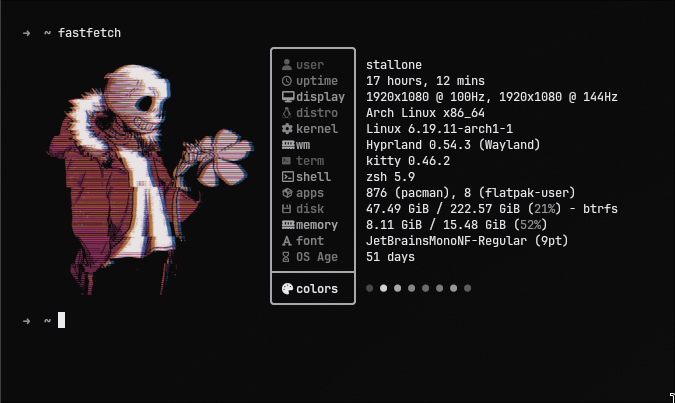
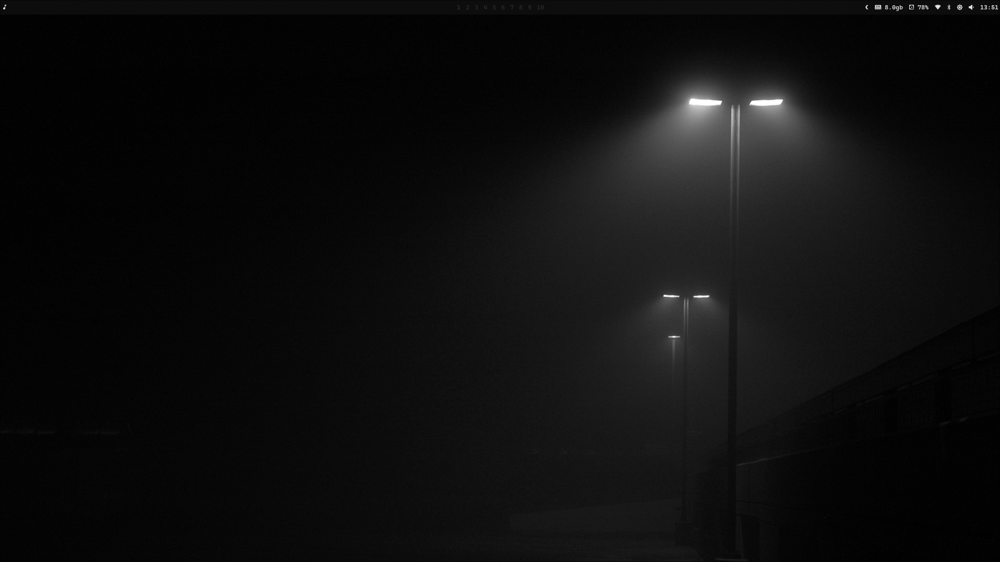

<div align="center">



<br/>

**Arch + Hyprland on a Razer Blade 15**

<br/>



</div>

---

## Details

| | Component | Tool |
|---|-----------|------|
| **OS** | Distro | Arch Linux |
| **WM** | Compositor | [Hyprland](https://hyprland.org) |
| **Bar** | Status Bar | [Waybar](https://github.com/Alexays/Waybar) |
| **Terminal** | Emulator | [Kitty](https://sw.kovidgoyal.net/kitty/) |
| **Shell** | Shell | [Fish](https://fishshell.com) |
| **Editor** | Code | [Neovim](https://neovim.io) |
| **Launcher** | App Launcher | [Rofi](https://github.com/lbonn/rofi) |
| **Notify** | Notifications | [SwayNC](https://github.com/ErikReider/SwayNotificationCenter) |
| **Files** | File Manager | [Yazi](https://yazi-rs.github.io) |
| **Music** | Player | [MPD](https://musicpd.org) + [RMPC](https://github.com/mierak/rmpc) |
| **Fetch** | System Info | [Fastfetch](https://github.com/fastfetch-cli/fastfetch) |
| **Lock** | Lock Screen | [Hyprlock](https://github.com/hyprwm/hyprlock) |
| **Idle** | Idle Daemon | [Hypridle](https://github.com/hyprwm/hypridle) |
| **Font** | Monospace | JetBrains Mono Nerd Font |

---

## Structure

```
.
├── .config/
│   ├── hypr/            # Hyprland — WM, bindings, animations, window rules
│   ├── waybar/          # Status bar config + scripts
│   ├── kitty/           # Terminal emulator
│   ├── fish/            # Shell — config, aliases, functions
│   ├── nvim/            # Neovim config
│   ├── rofi/            # Launcher + picker scripts
│   ├── yazi/            # Terminal file manager
│   ├── fastfetch/       # System fetch
│   ├── btop/            # System monitor
│   ├── swaync/          # Notification center
│   ├── matugen/         # Dynamic wallpaper-based color generation
│   ├── tmux/            # Terminal multiplexer
│   ├── mpd/             # Music daemon
│   ├── rmpc/            # MPD client
│   ├── lazygit/         # Git TUI
│   └── ...
├── scripts/             # Utility scripts
├── themes/              # Theme configs
├── install/             # Installer + theme engine
├── install.sh           # One-command setup
└── uninstall.sh         # Clean removal
```

---

## Keybindings

| Keys | Action |
|------|--------|
| `Super + Return` | Terminal (Kitty) |
| `Super + B` | Browser |
| `Super + E` | File Manager |
| `Super + Q` | Close Window |
| `Super + F` | Fullscreen |
| `Super + Space` | App Launcher (Rofi) |
| `Super + 1-9` | Switch Workspace |
| `Super + Shift + 1-9` | Move Window to Workspace |
| `Alt + Q` | Yazi |
| `Alt + N` | Neovim |
| `Alt + M` | Music (RMPC) |
| `Alt + /` | System Monitor (btop) |

> Full list in [`.config/hypr/bindings.conf`](.config/hypr/bindings.conf)

---

## Installation

```bash
git clone https://github.com/Stallone2K/dots.git ~/.dots
cd ~/.dots
./install.sh
```

---

## License

MIT &copy; Stallone Fernandes
